User creates new note in https://studies.cs.helsinki.fi/exampleapp/notes

```mermaid
sequenceDiagram
    participant browser
    participant server

    browser->>server: POST https://fullstack-exampleapp.herokuapp.com/new_note Form data: { "note": "testi" }
    activate server
    server-->>browser: HTML document
    deactivate server

    Note right of browser: The server pushes the new note to the back of the notes list.

    browser->>server: GET https://studies.cs.helsinki.fi/exampleapp/notes
    activate server
    server-->>browser: the HTML document for notes page
    deactivate server

    browser->>server: GET https://studies.cs.helsinki.fi/exampleapp/main.css
    activate server
    server-->>browser: the CSS file
    deactivate server

    browser->>server: GET https://studies.cs.helsinki.fi/exampleapp/main.js
    activate server
    server-->>browser: the JS file
    deactivate server

    Note right of browser: The browser starts executing the JavaScript code that fetches the notes data JSON from the server

    browser->>server: GET https://studies.cs.helsinki.fi/exampleapp/data.json
    activate server
    server-->>browser: [{"content":"Hello , Welcom to the note app","date":"2024-04-09T12:54:03.359Z"},{"content":"Defensive projection detected! ☝ A mentally challenged individual calling others retarded. 🙄","date":"2024-04-09T12:54:52.539Z"} (truncated to save space so the graphs are rendered ok ) ...}]
    deactivate server

    Note right of browser: The browser executes the callback function that renders the notes
```

User goes to the single page app at [https://studies.cs.helsinki.fi/exampleapp/notes](https://studies.cs.helsinki.fi/exampleapp/spa)

User creates a new note in the single page app at [https://studies.cs.helsinki.fi/exampleapp/notes](https://studies.cs.helsinki.fi/exampleapp/spa)

